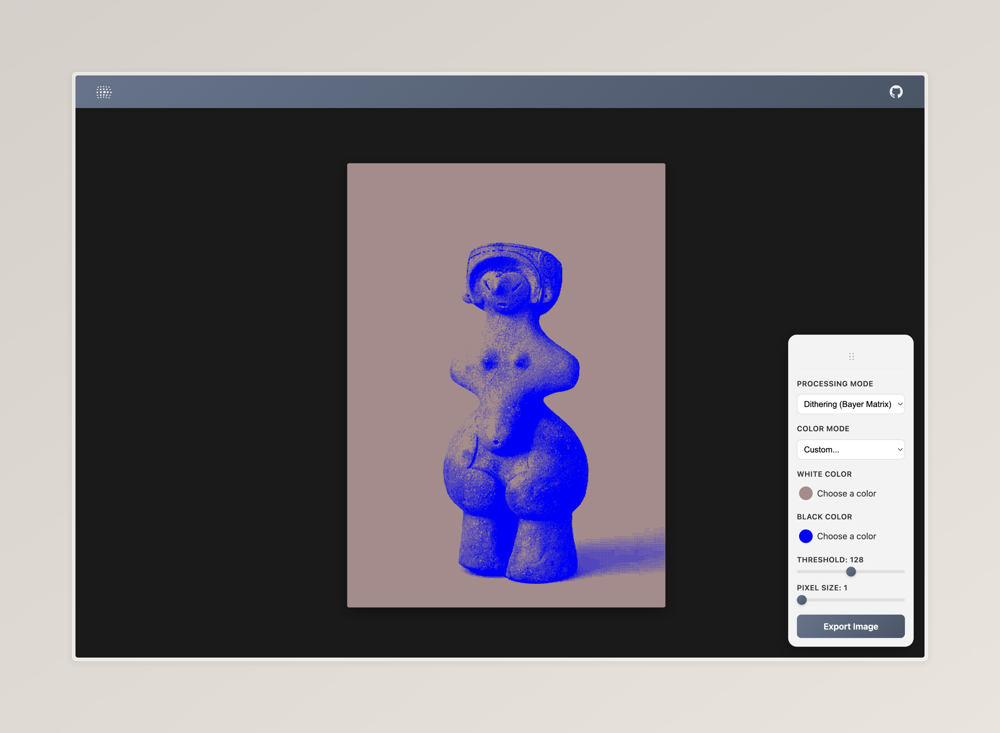

#  Dither Field

A browser-based image dithering tool built with SvelteKit and Canvas. Apply dithering effects to images entirely client-side with no backend required.

## Preview


## Getting Started

### Prerequisites

- Node.js 18+ and npm

### Installation

```sh
npm install
```

### Development

```sh
npm run dev

# or start the server and open the app in a new browser tab
npm run dev -- --open
```

Visit `http://localhost:5173` to use the app.

### Build for Production

```sh
npm run build
```

The static site will be built to the `build/` directory and can be deployed anywhere.

### Preview Production Build

```sh
npm run preview
```

## Project Structure

```
src/
├── lib/
│   ├── components/
│   │   └── ImageProcessor.svelte    # Main UI component
│   ├── workers/
│   │   └── image.worker.ts          # Web Worker for image processing
│   └── types.ts                     # TypeScript type definitions
├── routes/
│   ├── +page.svelte                 # Main page
│   └── +layout.ts                   # Layout config (enables prerendering)
└── app.html                         # HTML template
```

